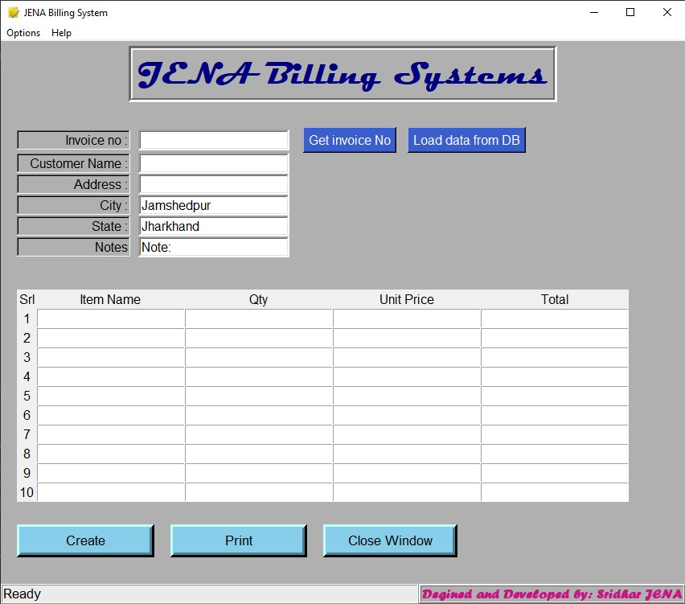
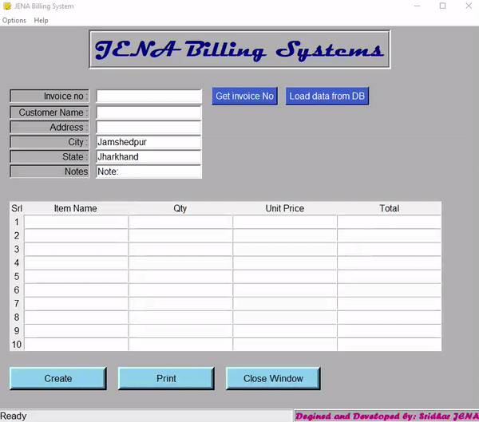
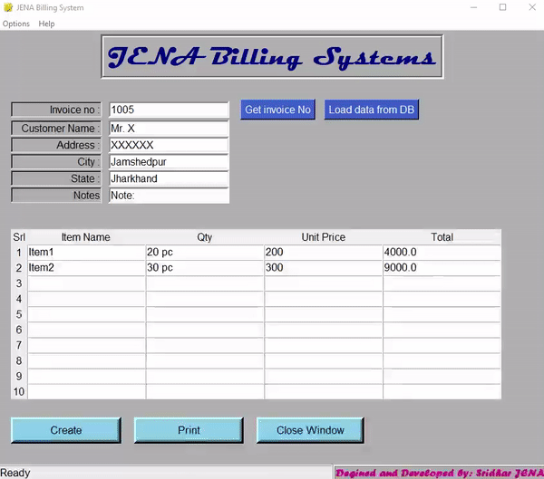
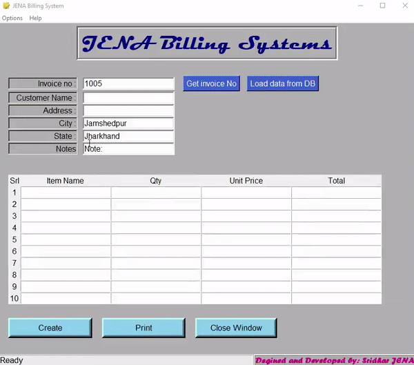

# Introducing JENA BILLING SYSTEM


[](https://travis-ci.org/joemccann/dillinger)

This is a billing system developed by Mr. Sridhar Jena for general billing purpose. This software is sole property of SRIDHWORK. Copy should not be used for commertial purpose.


# Features!

***Attractive UI***




**User Can get the next invoice number by clicking get invoice**




**User can load data from DB by providing invoice number**


**User can create invoice by entering details of invoice**
  


**User can print an invoice**
**User can save PDF copy of an invoice**
  



**User can check invoice history. goto Options->History**
  


**User can modify template data as per their business. goto Options->Settings**


### Tech

This application uses a number of open source projects to work properly:

* [Python] - Base Interpreter!
* [Tkinter] - awesome GUI library for python
* [ghostscript] - Awesome library for dealing PS, PDF and many more.
* [VS Code] - An awesome source code editor
* [Other-Python Modules] - Thanks to all opensource python modules used in this project

And of course this app itself is open source with a [public repository]
 on GitHub.

### Installation

Install the dependencies and devDependencies and start the Application.
Note: These command only work on windows system with chocolaty installed. All script requre elevated powershell window
for chocolaty installation please view [official installation page](https://chocolatey.org/install)
```sh
$ choco install python
$ choco install ghostscript
$ pip install pillow
$ pip install tkcalender
```

For .exe application installed in windows...

```sh
$ choco install ghostscript
```
For linux users ...
 install ghostscript through [this guide](https://www.ghostscript.com/doc/current/Install.htm)

### Plugins

This app currently not using/support any plugins


### Development

Want to contribute? Great!

Open your favorite Terminal and run these commands.

Note: These command only work on windows system with chocolaty installed. All script requre elevated powershell window
for chocolaty installation please view [official installation page](https://chocolatey.org/install)

First Tab:
```sh
$ choco install git
$ choco install python
$ choco install ghostscript
$ pip install pillow
$ pip install tkcalender
```

Second Tab:
Install code editor of your fevorite
```sh
$ choco install vscode
```

(optional) Third:
```sh
$ 
```

### Todos

 - Add data visualization using pyplot
 - Add Night Mode

License
----

Read License Terms. 


**Free Software, Hell Yeah! Enjoy!!!**
For customization please contact me on my email sridhwork@gmail.com
